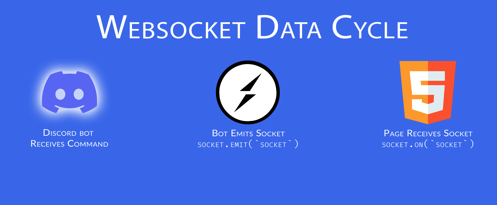

<!-- classes: pop -->

# Adding video programatically to OBS Studio

Let's take your video to the next level!

## Prerequisites:

- React/ JavaScrip\*
- OBS Studio (Mac, Windows, or Linux)
- Some Node.js || Node 16.x+

## This Presentation and Relevant Files:

http://github.com/thompsonplyler/ttt-presentation

---

# Websockets



---

# Dependencies

- discord.js
- dotenv
- express
- socket.io
- socket.io-client

```bash
npm i discord.js dotenv express socket.io socket.io-client
```

```html
<!-- CDN for socket.io @ displayed HTML -->
<script
  src="https://cdn.socket.io/4.4.1/socket.io.min.js"
  integrity="sha384-fKnu0iswBIqkjxrhQCTZ7qlLHOFEgNkRmK2vaO/LbTZSXdJfAu6ewRBdwHPhBo/H"
  crossorigin="anonymous"
></script>
```

---

# Resources

- [OBS Studio 27.2.4](https://github.com/obsproject/obs-studio/releases/tag/27.2.4)
- [Discord.js website](https://discord.js.org/)
- [Discord.js documentation](https://discordjs.guide/#before-you-begin)
- [Socket.io](https://socket.io/)
- [Socket.io chat app tutorial](https://socket.io/get-started/chat)
